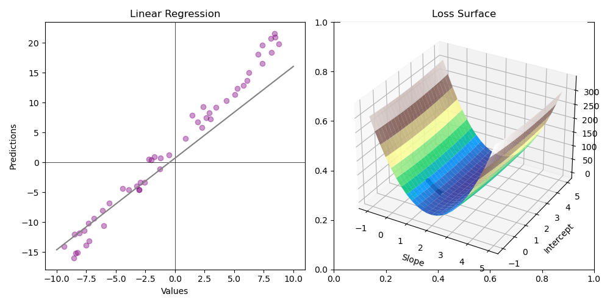

This project presents an interactive visualization of gradient descent, aiming to bridge the gap between theory and practice. Real-time animation illustrates the iterative nature of the algorithm, while customizable parameters allow users to explore its behavior. Pre-built scenarios showcase gradient descent's adaptability to different optimization landscapes. Informative annotations provide insights into key factors, such as learning rate and cost functions. Simple controls enable users to pause, resume, and inspect each step. This project offers an immersive learning experience, empowering users to grasp the intricacies of gradient descent and apply it effectively.

> [!info] Updates
> CLI version with Matplotlib viz is available on github
> Web App with Plotly, Dash, and Flask coming out soon

---
[github](https://github.com/harshangchhaya/GradientDescentViz/tree/cli)

---
#### Upcoming
- Web App implementation with CI/CD updates
- Support for more Gradient Descent Algorithms 
- Support for more Cost Functions
- Support for different data 